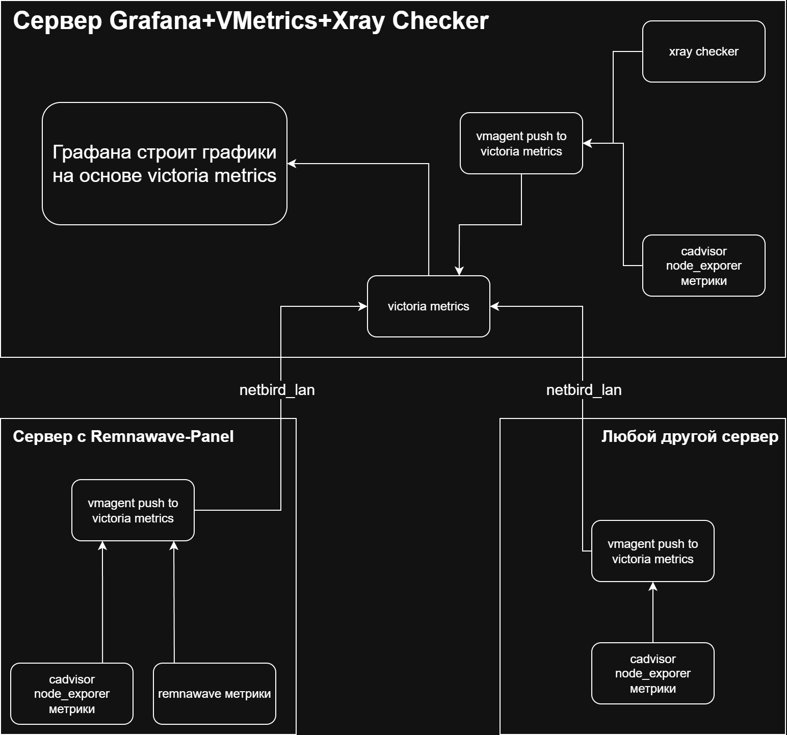

# Установка и настройка системы мониторинга: Grafana / Victoria Metrics / Node Exporter / cAdvisor / Xray Checker через NetBird \+ конфигурация nginx.

🤝 Огромная благодарность за помощь в написании статьи: [Sergey Kutovoy](https://github.com/kutovoys)

Сегодня мы с вами познакомимся с полной установкой системы мониторинга и его работу через NetBird, но прежде чем мы начнем, нужно изучить [инструкцию по установке и настройке NetBird](https://wiki.egam.es/ru/configuration/netbird).

## Небольшое вступление.
Данная инструкция ознакомит вас с установкой системы мониторинга вашей инфраструктуры, и написана она с учетом установки на отдельный управляющий сервер.

Немного базового пояснения:

Grafana - это инструмент, который преобразует различные формы метрик, полученных от Victoria Metrics, в визуальные формы для аналитического и системного мониторинга.

Victoria Metrics (VMetrics) - это непосредственно система сбора и хранения метрик со всех машин, полученных от агента, а vmagent - доставщик этих метрик в vmetrics.

Node Exporter - инструмент сбора метрик. Он собирает информацию о различных ресурсах узла, таких как загрузка процессора, использование памяти, дисковый ввод-вывод, сетевая статистика и другие.

cAdvisor - так-же является инструментом сбора метрик. Собирает информацию о производительности Docker-контейнеров.

Xray-Checker - проверка состояния ваших прокси-хостов, и отправка метрик в Victoria Metrics.

Для того, чтобы понять как это работает приложу небольшую схему:



Схема поможет понять вам, какой компонент ставить на какой сервер.

Вся наша схема будет работать через Netbird, открывать порты наружу нет необходимости. Необходимо будет открыть только 443 для Grafana.


> [!IMPORTANT]
> **Выпуск сертификатов для вашего домена в этой статье не рассматривается. Сертификаты домена перед запуском docker-compose надо положить в /opt/monitoring/nginx, или прокинуть нужный volume где лежат сетификаты.**

> [!CAUTION]
> **Все команды используем через root: sudo su**

## Конфигурация сервера с Grafana/VMetrics.
Устанавливаем Docker.
```bash
curl -fsSL https://get.docker.com | sh
```
Создаём директории и создаём docker-compose.yml.

```bash
mkdir -p /opt/monitoring/{cadvisor,nodeexporter,nginx,vmagent/conf.d} && cd /opt/monitoring && nano docker-compose.yml
   ```
Вставляем содержимое:

```yaml
services:
  vmsingle:
    image: victoriametrics/victoria-metrics:v1.124.0
    container_name: vmsingle
    hostname: vmsingle
    restart: unless-stopped
    volumes:
      - ./victoria-metrics-data:/victoria-metrics-data
    command:
      - '--storageDataPath=/victoria-metrics-data'
    networks:
      - grafana-network
    ports:
      - x.x.x.x:8428:8428 # Тут указываем NetBird IP этой машины

  grafana:
    image: grafana/grafana:12.2.0-17027759091
    container_name: grafana
    hostname: grafana
    restart: unless-stopped
    volumes:
      - grafana-data:/var/lib/grafana
      - ./grafana/provisioning:/etc/grafana/provisioning
    environment:
      - GF_SERVER_DOMAIN=example.com # основной домен до графаны, не забываем добавить DNS-запись для него (если повесили на sub-домен, тут надо вписать целевой домен)
      - GF_SERVER_ROOT_URL=https://example.com/grafana # полный путь до графаны (впишем в nginx.conf потом), не забываем добавить DNS-запись для него
      - GF_SERVER_SERVE_FROM_SUB_PATH=true
      - GF_SERVER_HTTP_PORT=3000
      - GF_SERVER_PROTOCOL=http
      - GF_SECURITY_ADMIN_USER=admin
      - GF_SECURITY_ADMIN_PASSWORD=admin
      - GF_ANALYTICS_REPORTING_ENABLED=false
    networks:
      - grafana-network

  xray-checker:
    image: kutovoys/xray-checker
    container_name: xray-checker
    hostname: xraychecker
    restart: unless-stopped
    environment:
      - "SUBSCRIPTION_URL=https://subscription_link" # Тут указываем ссылку-подписку для XrayChecker
      - "PROXY_STATUS_CHECK_URL=http://google.com/generate_204"
      - "PROXY_CHECK_INTERVAL=60"
    ports:
      - 127.0.0.1:2112:2112
    networks:
      - grafana-network


  grafana-nginx:
    image: nginx:1.28
    container_name: grafana-nginx
    volumes:
        - ./nginx/nginx.conf:/etc/nginx/conf.d/default.conf:ro
        - ./nginx/fullchain.pem:/etc/nginx/ssl/fullchain.pem:ro
        - ./nginx/privkey.key:/etc/nginx/ssl/privkey.key:ro
    restart: unless-stopped
    ports:
      - 443:443
    networks:
      - grafana-network


volumes:
  grafana-data:

networks:
  grafana-network:
    name: grafana-network
    driver: bridge
    external: false
```
Поля, которые надо подкорректировать указаны комментариями в yaml.

## Конфигурация nginx
Создаём nginx.conf файл.
```bash
nano /opt/monitoring/nginx/nginx.conf
```
```nginx

server {
    listen 443 ssl;
	http2 on;
    server_name example.com; #Вписываем домен, или саб-домен для доступа к grafana извне (нужна соотвествующая DNS-запись)

    ssl_certificate "/etc/nginx/ssl/fullchain.pem";
    ssl_certificate_key "/etc/nginx/ssl/privkey.key";
    ssl_trusted_certificate "/etc/nginx/ssl/fullchain.pem";
	ssl_protocols TLSv1.2 TLSv1.3;
	ssl_ecdh_curve X25519:prime256v1:secp384r1;
	ssl_ciphers ECDHE-ECDSA-AES128-GCM-SHA256:ECDHE-RSA-AES128-GCM-SHA256:ECDHE-ECDSA-AES256-GCM-SHA384:ECDHE-RSA-AES256-GCM-SHA384:ECDHE-ECDSA-CHACHA20-POLY1305:ECDHE-RSA-CHACHA20-POLY1305:DHE-RSA-AES128-GCM-SHA256:DHE-RSA-AES256-GCM-SHA384:DHE-RSA-CHACHA20-POLY1305;
	ssl_prefer_server_ciphers on;
	ssl_session_timeout 1d;
	ssl_session_cache shared:MozSSL:10m;
	ssl_session_tickets off;

    location /grafana {
        proxy_pass http://grafana:3000;
        proxy_set_header Host $host;
        proxy_set_header X-Real-IP $remote_addr;
        proxy_set_header X-Forwarded-For $proxy_add_x_forwarded_for;
        proxy_set_header X-Forwarded-Proto $scheme;
    }
}

```
Теперь запускаем композ-файл.
```bash
docker compose up -d && docker compose logs -f -t
```
## Установка и настройка компонентов на серверах, где нужен сбор метрик.

> [!TIP]
> **Если вы хотите в Grafana видеть метрики самого сервера мониторинга - ставьте node exporter, cadvisor и vmagent так-же на сервер мониторинга. (описано на схеме выше)**

> [!IMPORTANT]
> **Для сервера с Remnawave-панелью и сервера, где установлен xray-checker (в нашем случае на сервере с мониторингом) нужны отдельные scrape-файлы, аннотациями помечено ниже.**

> [!TIP]
> **Создаём папки только на нодах, на мейн сервере уже созданы**
```bash
mkdir -p /opt/monitoring/{cadvisor,nodeexporter,vmagent/conf.d}
```
Качаем и распаковываем/переименовываем бинарники и делаем их исполняемыми:

```bash
cd /opt/monitoring/cadvisor && wget https://github.com/google/cadvisor/releases/download/v0.53.0/cadvisor-v0.53.0-linux-amd64 && mv cadvisor-v0.53.0-linux-amd64 cadvisor && chmod +x cadvisor && cd /opt/monitoring/nodeexporter && wget https://github.com/prometheus/node_exporter/releases/download/v1.9.1/node_exporter-1.9.1.linux-amd64.tar.gz && tar -xvf node_exporter-1.9.1.linux-amd64.tar.gz && cd node_exporter-1.9.1.linux-amd64 && mv node_exporter /opt/monitoring/nodeexporter && cd .. && chmod +x node_exporter && rm -f node_exporter-1.9.1.linux-amd64.tar.gz && rm -r node_exporter-1.9.1.linux-amd64 && cd /opt/monitoring/vmagent && wget https://github.com/VictoriaMetrics/VictoriaMetrics/releases/download/v1.123.0/vmutils-linux-amd64-v1.123.0.tar.gz && tar -xvf vmutils-linux-amd64-v1.123.0.tar.gz && mv vmagent-prod vmagent && find . ! -name 'vmagent' -type f -delete && chmod +x vmagent && cd
```
Создаём файл конфигурации для vmagent:

```bash
nano /opt/monitoring/vmagent/scrape.yml
```
и вставляем содержимое:
```yaml
scrape_config_files:
  - "/opt/monitoring/vmagent/conf.d/*.yml"

global:
  scrape_interval: 15s
```
Создаём файлы конфигурации сбора метрик:
> [!CAUTION]
> **Следите, чтобы у всех scrape-файлов в папке conf.d был отсуп в 2 символа в первой строке**
> **Не забудьте поменять названия instance в каждом scrape-файле, например при установке на SERVER1 во всех scrape-файлах будет instance: "SERVER1"**
#### cadvisor.yml

```
nano /opt/monitoring/vmagent/conf.d/cadvisor.yml
```

```yaml
  - job_name: integrations/cAdvisor
    scrape_interval: 15s
    static_configs:
      - targets: ['localhost:9101']
        labels:
          instance: "ваше_название_инстанса(ноды)"
```

#### nodeexporter.yml

```
nano /opt/monitoring/vmagent/conf.d/nodeexporter.yml
```

```yaml
  - job_name: integrations/node_exporter
    scrape_interval: 15s
    static_configs:
      - targets: ['localhost:9100']
        labels:
          instance: "ваше_название_инстанса(ноды)"
```

> [!TIP]
> **На машине, где стоит xray-checker (в нашем случае сервер мониторинга) надо создать файл конфигурации.**

```
nano /opt/monitoring/vmagent/conf.d/xraychecker.yml
```

```yaml
  - job_name: xray_checker
    scrape_interval: 15s
    static_configs:
      - targets: ['127.0.0.1:2112']
        labels:
          instance: "ваше_название_инстанса(ноды)"
```
> [!TIP]
> **На машине, где стоит remnawave-panel надо создать файл конфигурации.**
> Не забудьте прокинуть порт 3001 (- 127.0.0.1:3001:3001) в docker-compose remnawave, и вписать логин/пароль от метрик (находится в основном .env-файле remnawave, категория Prometheus)
```
nano /opt/monitoring/vmagent/conf.d/remnawave.yml
```
```yaml
  - job_name: remnawave
    scrape_interval: 15s
    static_configs:
      - targets: ['127.0.0.1:3001']
        labels:
          instance: "ваше_название_инстанса(ноды)"
    basic_auth:
      username: "XXXXXXXXXXXXXXX"
      password: "XXXXXXXXXXXXXXX"
```
> [!IMPORTANT]
> **Такая реализация структуры scrape-файлов в дальнейшем позволит подкидывать новые jobs на горячую, не перезапуская службу.**

Теперь нам надо создать файлы служб наших бинарников и добавить их в автозапуск:

#### cadvisor:

```bash
nano /etc/systemd/system/cadvisor.service
```

```service
[Unit]
Description=cAdvisor
Wants=network-online.target
After=network-online.target

[Service]
User=root
Group=root
Type=simple
ExecStart=/opt/monitoring/cadvisor/cadvisor \
			-listen_ip=127.0.0.1 \
			-logtostderr \
			-port=9101 \
			-docker_only=true
Restart=always
RestartSec=5

[Install]
WantedBy=multi-user.target
```

#### node exporter:

```bash
nano /etc/systemd/system/nodeexporter.service
```

```service
[Unit]
Description=Node Exporter
Wants=network-online.target
After=network-online.target

[Service]
User=root
Group=root
Type=simple
ExecStart=/opt/monitoring/nodeexporter/node_exporter --web.listen-address=127.0.0.1:9100
Restart=always
RestartSec=5

[Install]
WantedBy=multi-user.target
```

#### vmagent:

```bash
nano /etc/systemd/system/vmagent.service
```
> [!WARNING]
> **Обратите внимание: в строке -remoteWrite.url=http://IP_NETBIRD:8428/api/v1/write надо заменить на IP Netbird сервера с Victoria Metrics, который мы прописали в docker-compose**

```service
[Unit]
Description=VictoriaMetrics Agent
Wants=network-online.target
After=network-online.target

[Service]
User=root
Group=root
Type=simple
ExecStart=/opt/monitoring/vmagent/vmagent \
	    -httpListenAddr=127.0.0.1:8429 \
	    -promscrape.config=/opt/monitoring/vmagent/scrape.yml \
	    -promscrape.configCheckInterval=60s \
	    -remoteWrite.url=http://IP_NETBIRD:8428/api/v1/write
Restart=always
RestartSec=5

[Install]
WantedBy=multi-user.target
```

Теперь помещаем все службы в автозапуск и запускаем их:
```bash
systemctl daemon-reload && systemctl enable cadvisor nodeexporter vmagent && systemctl start cadvisor nodeexporter vmagent
```
Проверим состояние служб, должны быть в статусе ACTIVE:
```
systemctl status cadvisor
systemctl status nodeexporter
systemctl status vmagent
```
Теперь заходим в Grafana по домену, которому вы указали в nginx, заходим стандартными логин/пароль (admin/admin), меняем его, и следуем по пути в Conntections - Data Sources, нажимаем Add Data Source, выбираем prometheus, в connections пишем http://vmsingle:8428

Мы подключили Victoria Metrics к Grafana.

Дашборды подключаются через Dashboards - New - Import. Копируем JSON дашборда ниже, и вставляем в импорт.

Пак дашбордов от комьюнити:

- [Remnawave Dashboard](https://raw.githubusercontent.com/pluralplay/awesome-docs/main/grafana/dashboards/remnawave-dashboard.json) by [kastov](https://github.com/kastov)
- [cAdvisor Dashboard](https://raw.githubusercontent.com/pluralplay/awesome-docs/main/grafana/dashboards/cadvisor.json) by [grafana official](https://github.com/grafana)
- [Node Overview](https://raw.githubusercontent.com/pluralplay/awesome-docs/main/grafana/dashboards/node-overview.json) by [Kutovoys](https://github.com/kutovoys)
- [Network System](https://raw.githubusercontent.com/pluralplay/awesome-docs/main/grafana/dashboards/network.json) by [Kutovoys](https://github.com/kutovoys)
- [Memory System](https://raw.githubusercontent.com/pluralplay/awesome-docs/main/grafana/dashboards/memory.json) by [Kutovoys](https://github.com/kutovoys)
- [Filesystem Disks](https://raw.githubusercontent.com/pluralplay/awesome-docs/main/grafana/dashboards/filesystem-disks.json) by [Kutovoys](https://github.com/kutovoys)
- [CPU System](https://raw.githubusercontent.com/pluralplay/awesome-docs/main/grafana/dashboards/cpu-system.json) by [Kutovoys](https://github.com/kutovoys)

В следующей Extended-версии документации мы обойдемся без netbird, и научим Victoria Metrics собирать метрики через внешку с дополнительной авторизацией.
